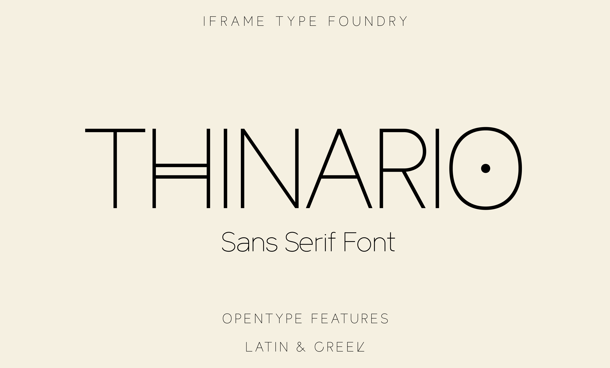
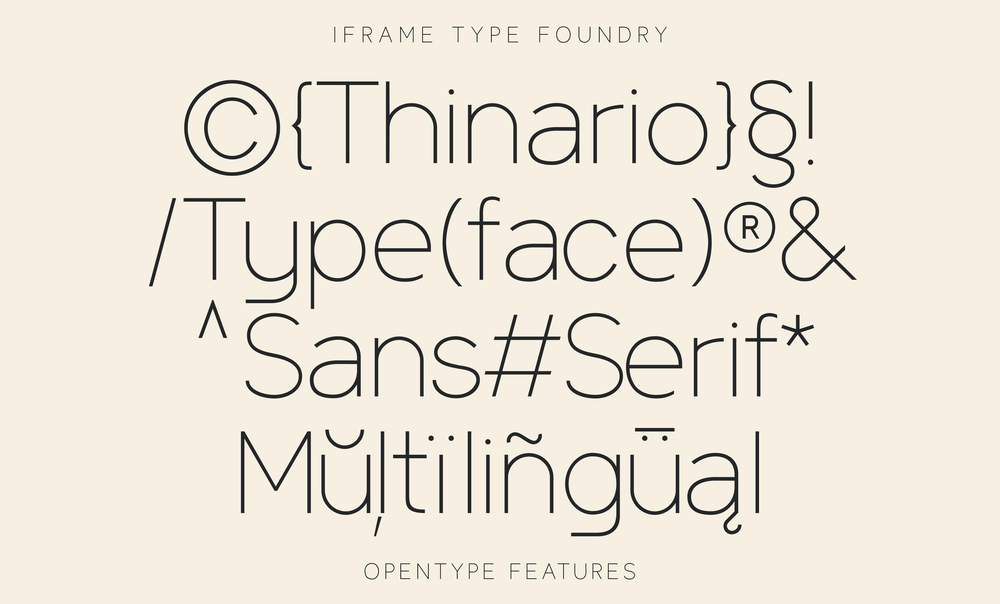
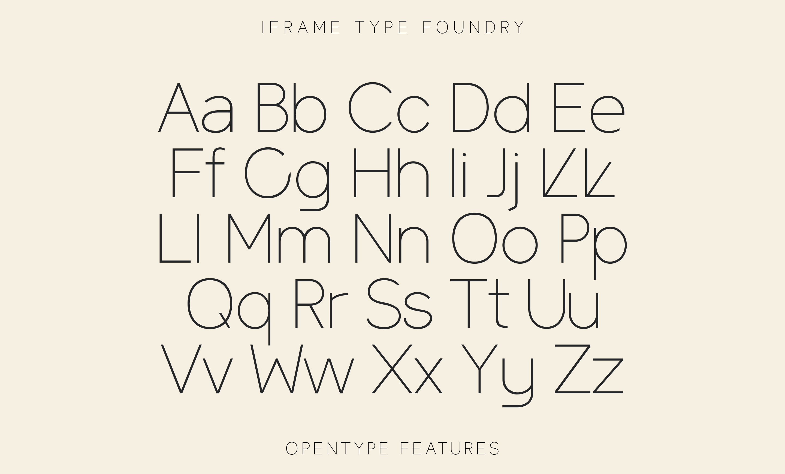
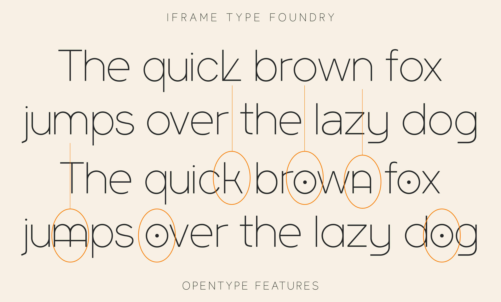
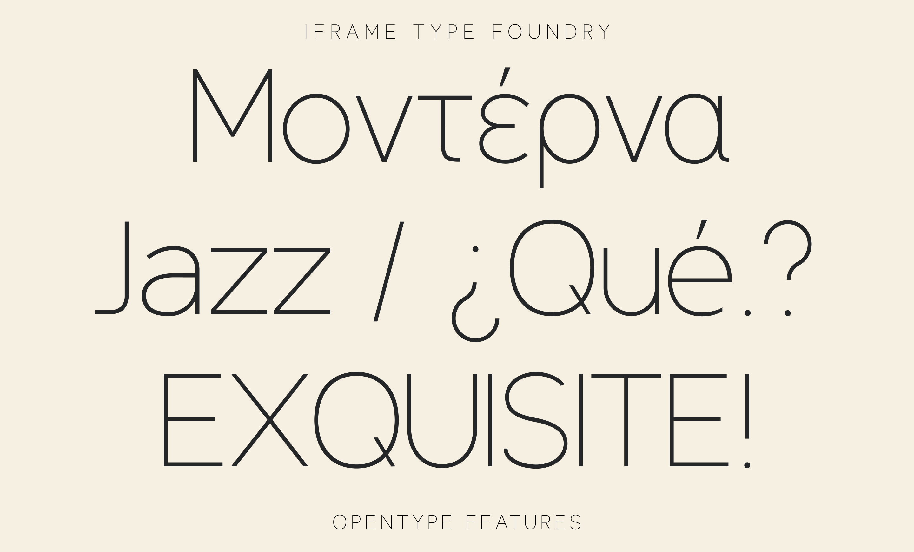

## About

Thinario is a sans serif typeface by iframe type foundry

## Foundry information:

Hi, we are iframe type foundry.
Discover beautifully designed, latin and greek fonts, that elevate your projects from digital screens to printed masterpieces.

The production of custom typefaces is an integral part of the iframe design studio approach and typography exploration. Our team is a mix of creative visual designers who developed typefaces for and alongside specific graphic design projects. We appreciate the value that typography brings to brands and their audiences.

Website: https://iframefonts.com

## Designer information:

Georgios Chalkidis (b. 1981) is a multimedia designer originally from the suburbs of Preveza, Greece. He studied Multimedia Design at the University of Sunderland, UK. Georgios has created custom design projects for notable clients. Among his notable releases are innovative digital experiences and interactive design systems that have garnered international recognition for their creativity and functionality.

Twitter: https://x.com/geo_chalkidis

## Changelog

**17 Jun 2025. Version 1.1**
- UPLOAD FILES

## License

This Font Software is licensed under the SIL Open Font License, Version 1.1.
This license is available with a FAQ at https://openfontlicense.org

## Repository Layout

This font repository structure is inspired by [Unified Font Repository v0.3](https://github.com/unified-font-repository/Unified-Font-Repository), modified for the Google Fonts workflow.
