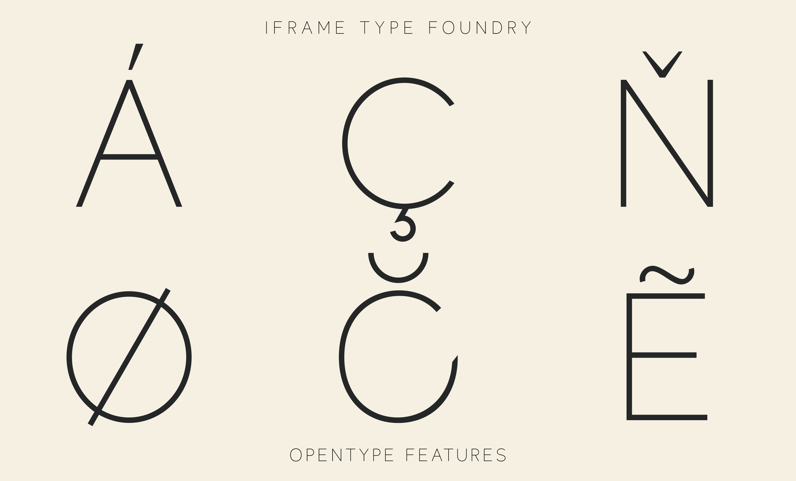

## About

Thinario is a sans serif typeface by iframe type foundry

## Foundry information:

iframe Type Foundry is dedicated to crafting beautifully designed Latin and Greek fonts that enhance projects across digital and print media.

The production of custom typefaces is a core element of iframe's design studio approach and typography exploration. Their team, a blend of creative visual designers, develops typefaces tailored to specific graphic design projects. iframe values the impact that thoughtful typography can have on brands and their audiences.

Website: https://iframefonts.com

## Designer information:

Georgios Chalkidis (b. 1981) is a multimedia designer originally from the suburbs of Preveza, Greece. He studied Multimedia Design at the University of Sunderland, UK. Georgios has created custom design projects for notable clients. Among his notable releases are innovative digital experiences and interactive design systems that have garnered international recognition for their creativity and functionality.

Twitter: https://x.com/geo_chalkidis

## Changelog

**17 Jun 2025. Version 1.1**
- UPLOAD FILES

## License

This Font Software is licensed under the SIL Open Font License, Version 1.1.
This license is available with a FAQ at https://openfontlicense.org

## Repository Layout

This font repository structure is inspired by [Unified Font Repository v0.3](https://github.com/unified-font-repository/Unified-Font-Repository), modified for the Google Fonts workflow.
